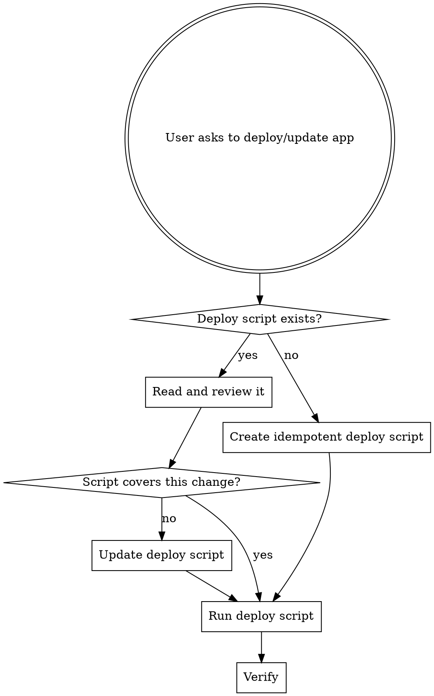

# Deploy App (Script-Based)

## The Rule

**NEVER run deployment commands directly.** Every deployment MUST go through a deploy script. If no script exists, create one first, then run it.

## Why

Direct deployment (ad-hoc shell commands) is:
- **Not repeatable** — next deploy requires re-figuring the steps
- **Not auditable** — no record of what was done
- **Error-prone** — easy to forget a step or run things out of order
- **Not idempotent** — may break if run twice

A deploy script is committed to the repo, reviewed, and safe to re-run.

## Workflow



## Step 1: Find an Existing Deploy Script

Search the project for an existing deploy script. Common locations and naming patterns:

```bash
# Check common locations
ls scripts/deploy*.sh deploy*.sh Makefile 2>/dev/null
# Check package.json for deploy scripts
grep -E '"deploy' package.json 2>/dev/null
```

Deploy scripts may live anywhere and be named anything — `scripts/deploy-prod-api.sh`, `deploy.sh`, a `deploy` target in a Makefile, or a `"deploy"` script in `package.json`. Look for what already exists before creating something new.

If a script exists, read it and assess whether it handles the current deployment. If it does, skip to Step 3.

## Step 2: Create or Update the Deploy Script

Write an **idempotent** deploy script. Name and locate it to match the project's conventions. If the project has a `scripts/` directory with other deploy scripts, put it there. If there's no convention yet, `deploy.sh` in the project root is fine.

The script must be safe to run multiple times with the same result.

### Idempotency Rules

Every operation in the script must be safe to repeat:

| Operation | Idempotent Pattern |
|-----------|--------------------|
| Clone repo | `if [ ! -d app ]; then git clone ...; fi` |
| Pull updates | `git pull` (always safe) |
| Install deps | `npm ci` / `pip install -r requirements.txt` (always safe) |
| Build | `npm run build` / `go build` (overwrites output, safe) |
| Create systemd unit | `tee` to write file (overwrites, safe) |
| Enable service | `systemctl enable` (idempotent) |
| Restart service | `systemctl restart` (always safe) |
| Create directory | `mkdir -p` (idempotent) |
| Set permissions | `chown` / `chmod` (idempotent) |
| rsync files | `rsync -av` (idempotent, `--delete` for clean sync) |

### Script Template

```bash
#!/usr/bin/env bash
set -euo pipefail

APP_DIR="${APP_DIR:-/home/claude/app}"
SERVICE_NAME="${SERVICE_NAME:-app}"

cd "$APP_DIR"
git pull

# --- Install dependencies & build ---
# (adapt to language: npm ci, pip install, go build, etc.)
npm ci
npm run build

# --- Systemd service ---
sudo tee /etc/systemd/system/${SERVICE_NAME}.service > /dev/null << EOF
[Unit]
Description=${SERVICE_NAME}
After=network.target

[Service]
Type=simple
User=claude
WorkingDirectory=${APP_DIR}
ExecStart=node ${APP_DIR}/dist/index.js
Restart=always
RestartSec=5
Environment=NODE_ENV=production

[Install]
WantedBy=multi-user.target
EOF

sudo systemctl daemon-reload
sudo systemctl enable "${SERVICE_NAME}"
sudo systemctl restart "${SERVICE_NAME}"

# --- Verify ---
sleep 2
sudo systemctl is-active "${SERVICE_NAME}"
echo "Deploy complete."
```

This is a starting point. Adapt to the actual app's language, build tool, runtime, and deployment target (local systemd, remote rsync+ssh, Docker, etc.). Make the script executable:

```bash
chmod +x <script-name>
```

## Step 3: Run the Script

```bash
./scripts/deploy-staging-api.sh   # or whatever the script is
```

Check output for errors. If the script fails, fix the **script** (not by running manual commands), then re-run it.

## Step 4: Verify

```bash
sudo systemctl status <service>
curl -s http://localhost:<port>/health
```

## Red Flags — STOP

If you catch yourself about to do any of these, STOP and use the script instead:

| Temptation | What to do instead |
|---|---|
| Running `git pull && npm ci && npm run build` directly | Put it in the deploy script, run the script |
| Running `systemctl restart` by hand after code changes | That's a deployment — use the script |
| "Just this one quick command" | No. Update the script, run the script |
| "The script doesn't handle this edge case" | Update the script to handle it |
| "I'll create the script after" | No. Script first, deploy second |
| Rsync/ssh commands to push code to a server | That belongs in the deploy script |

## Error Handling

- **Script fails mid-run**: Fix the script, re-run. Idempotency ensures safe re-execution.
- **Service won't start**: Check `journalctl -u <service> -n 50`. Fix in the script or app code, re-run the deploy script.
- **Port conflict**: `ss -tlnp | grep :<port>`. Resolve in the script or fix the conflicting process.
